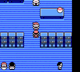
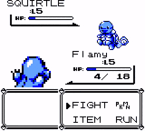
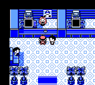
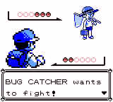
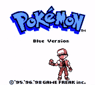
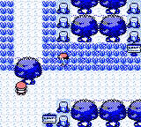
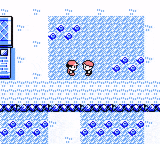
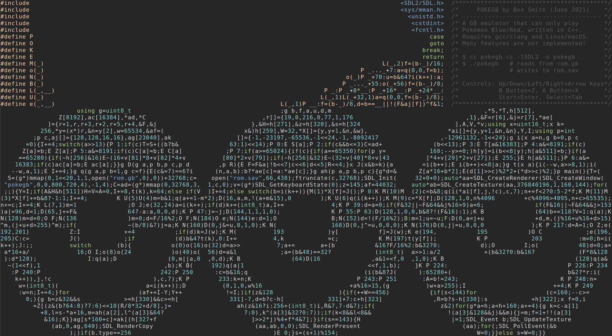

# pokegb

A gameboy emulator that only plays Pokemon Blue, in ~50 lines of c++.

See the [technical write-up](https://binji.github.io/posts/pokegb/).

## Features

Plays Pokemon Blue (and Red).

## Screenshots














## Building

Only builds on Linux and macOS AFAIK.

```
$ make
```

On macOS, you'll need to create a save file too (just the first time):

```
$ make rom.sav
```

## Running

Get a Pokemon Blue (or Pokemon Red) ROM file. The files that are known to work have the following sha1s:

| Name | sha1 |
| - | - |
| Pokemon - Blue Version (USA, Europe) (SGB Enhanced).gb | `d7037c83e1ae5b39bde3c30787637ba1d4c48ce2` |
| Pokemon - Red Version (USA, Europe) (SGB Enhanced).gb | `ea9bcae617fdf159b045185467ae58b2e4a48b9a` |

Others might work too, but these are the ones that I've tried.

Rename the file to `rom.gb` and put it in the current directory. Then run:

```
$ ./pokegb
```

The save file is written to `rom.sav`.

Keys:

| Action | Key |
| --- | --- |
| DPAD-UP | <kbd>↑</kbd> |
| DPAD-DOWN | <kbd>↓</kbd> |
| DPAD-LEFT | <kbd>←</kbd> |
| DPAD-RIGHT | <kbd>→</kbd> |
| B | <kbd>Z</kbd> |
| A | <kbd>X</kbd> |
| START | <kbd>Enter</kbd> |
| SELECT | <kbd>Tab</kbd> |

## Updating keys

Look for [line 24](https://github.com/binji/pokegb/blob/5444936aa7f12cb8c5c9c78e3c0c391ca4102f9b/pokegb.cc#L24) the source.
The following table shows which numbers map to which keyboard keys:

| number | default key | gameboy button |
| - | - | - |
| 27 | X | A Button |
| 29 | Z | B Button |
| 43 | Tab | Select Button |
| 40 | Return | Start Button |
| 79 | Arrow Right | DPAD Right |
| 80 | Arrow Left | DPAD Left |
| 81 | Arrow Down | DPAD Down |
| 82 | Arrow Up | DPAD Up |

Replace the numbers on this line with one from the [SDL scancode list](https://www.libsdl.org/tmp/SDL/include/SDL_scancode.h).
